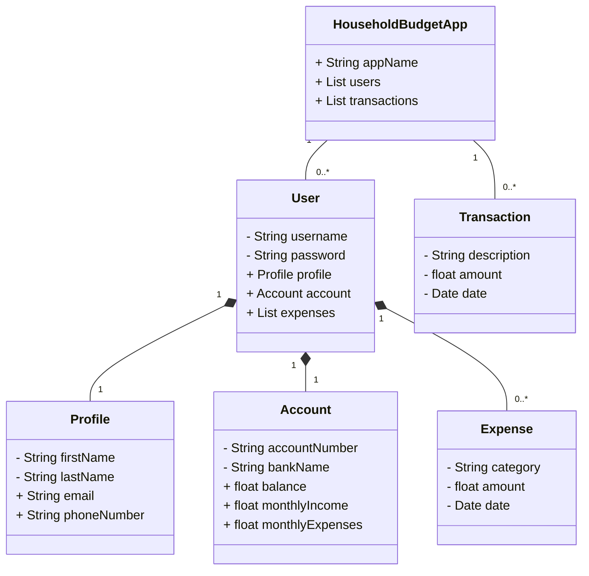

# Household Budget App (Em desenvolvimento)

RESTful API do Household Budget App, aplicativo para orçamento de despesas familiares  construída em Java 17 com Spring Boot 3.

## Principais tecnologias 
- **Java 17:** Utilizamos a versão mais recente e estável do Java para aproveitar as últimas inovações e recursos desta linguagem de programação amplamente adotada.

- **Spring Boot 3:** Uma estrutura altamente produtiva que simplifica o desenvolvimento de aplicativos Java, graças à sua capacidade de autoconfiguração e ampla adoção da comunidade.

- **Spring Data JPA:** Facilita a integração de bancos de dados SQL com nosso aplicativo, economizando tempo e esforço na camada de acesso aos dados.

- **OpenAPI (Swagger):** Criamos documentação de API clara e eficaz para simplificar o entendimento e o uso de nossa API, alinhando-se perfeitamente com a produtividade do Spring Boot.

- **Railway:** Esta plataforma torna o deploy e o monitoramento de nossas soluções na nuvem muito mais fáceis, oferecendo serviços de banco de dados e integração contínua/deploy contínuo (CI/CD) para nosso projeto.

## Diagrama de Classes 

## Documentação da API (Swagger)

[hbapp-api-rest-prd.up.railway.app/swagger-ui/index.html](https://hbapp-api-rest-prd.up.railway.app/swagger-ui/index.html)

