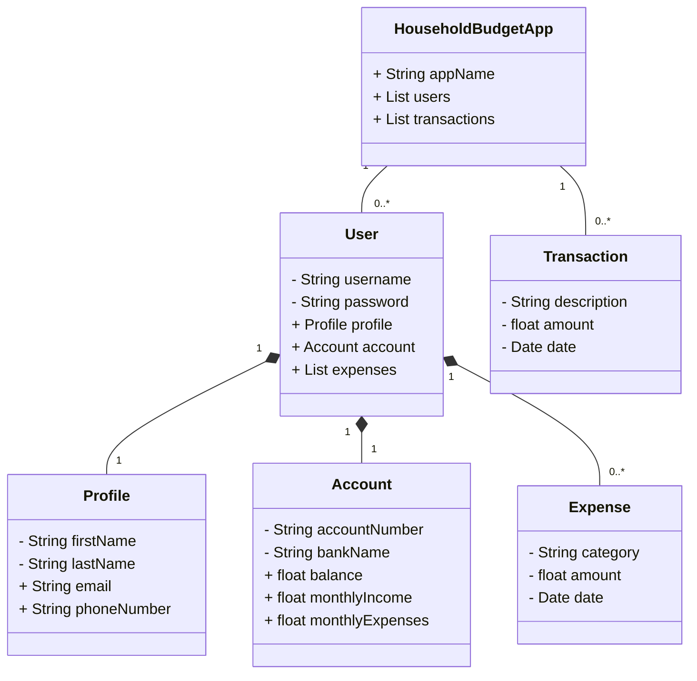

# Household Budget App

## Java RESTful API

## Diagrama de Classes 

```mermaid
classDiagram
    class HouseholdBudgetApp {
        + String appName
        + List<User> users
        + List<Transaction> transactions
    }

    class User {
        - String username
        - String password
        + Profile profile
        + Account account
        + List<Expense> expenses
    }

    class Profile {
        - String firstName
        - String lastName
        + String email
        + String phoneNumber
    }

    class Account {
        - String accountNumber
        - String bankName
        + float balance
        + float monthlyIncome
        + float monthlyExpenses
    }

    class Transaction {
        - String description
        - float amount
        - Date date
    }

    class Expense {
        - String category
        - float amount
        - Date date
    }

   HouseholdBudgetApp "1" -- "0..*" User
    User "1" *-- "1" Profile
    User "1" *-- "1" Account
    User "1" *-- "0..*" Expense
    HouseholdBudgetApp "1" -- "0..*" Transaction

```
